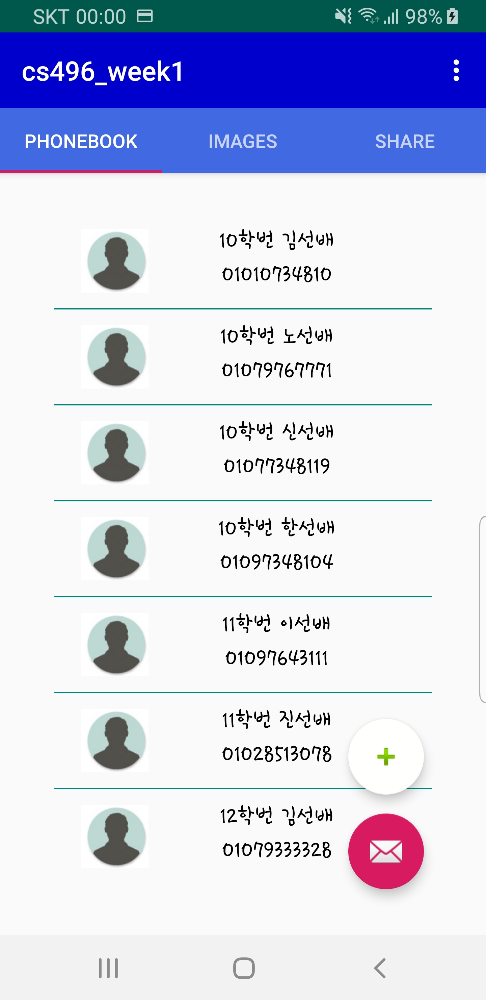
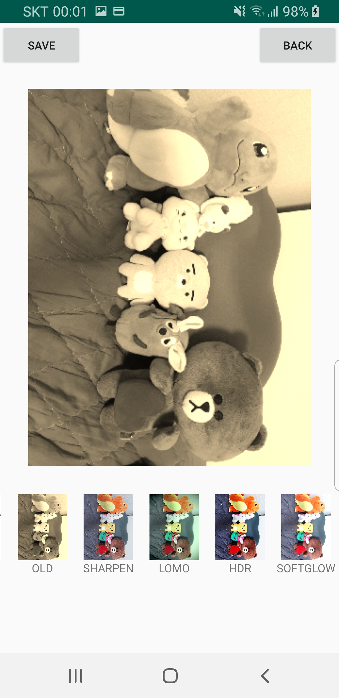
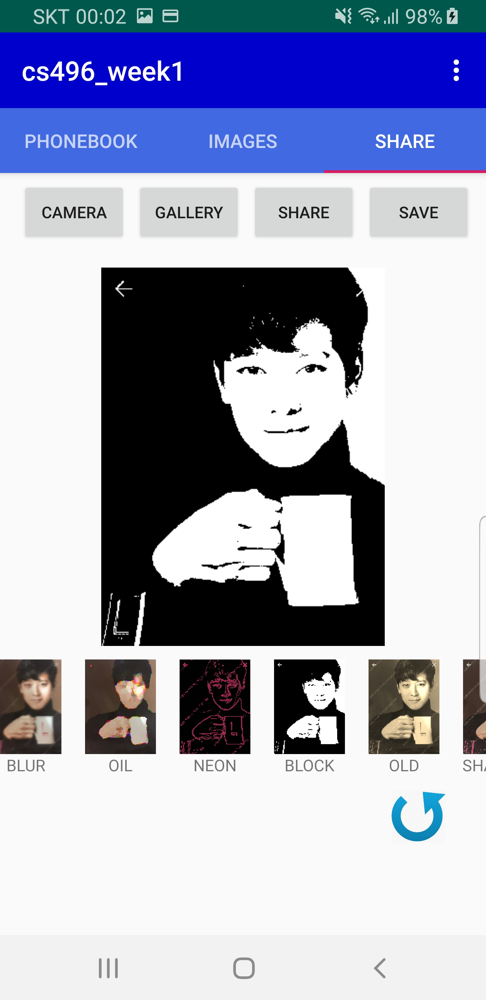

# Project ShareMyLife

- This project was done in the first week of 2018 Winter-CS496(몰입캠프) course at KAIST with [@hyeyoung0112](https://github.com/hyeyoung0112).   

## 1. Introduction
- The project's goal was to be familiar with application development and collaboration in 몰입캠프. 

## 2. Description
- There are four tabs: (1) Phone book, (2) Gallery, (3) Upload photos to SNS
- Although the additional functions could be implemented freely, the first and second tabs were mandatory.
- The third tab was freely selected topic.
  - I chose to implement uploading photos to SNS because linking android application with SNS seems fun.
#### 2.1 Phone book
  
- Displays the list of phone numbers in phone using gridview.
- Allow upward and downward scrolling.
- Allow selecting one person to send SMS.
- Allow adding contact in the application.
#### 2.2 Gallery

- Displays the list of photos in phone.
- Enable various filters to be applied to pictures.
#### 2.3 Upload photos to SNS

- Display a photo from gallery or an impromptu photograph using a camera.
- Enable various filters to be applied to pictures.
- Allow uploading filtered photo to SNS
  - Kakaotalk
  - Instagram
  - Facebook

## 3. Libraries and frameworks
- [FacebookAPI](https://developers.facebook.com/docs?locale=us)
- [KakaotalkAPI](https://developers.kakao.com/docs/sdk)
- [Picasso](https://square.github.io/picasso/)
- [ImageFilters](https://github.com/alhazmy13/ImageFilters)
